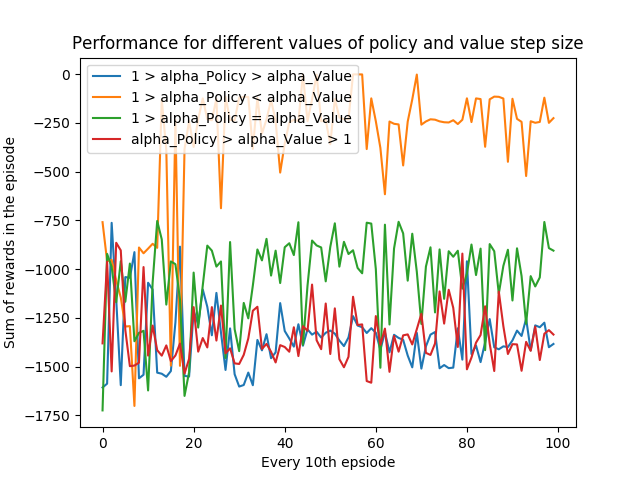

# Reinforcement-Learning---Actor-Critic

We're trying to analyze how convergence is affected by different combinations of step sizes for actor (policy) and critic (value) using the Pendulum environmnent. The policy used is a Gaussian Continuous Policy with the states being featurized using Radial Basis Functions (RBF)

Ideally the step size or the learning rate for the actor (policy) is smaller than that of the critic (value) mainly because it takes a while for the critic to catch up to the actor. As a result we modfiy the actor's learning rate to be samller than the critic's.
It is also recommended to keep the step sizes between 0 and 1.

In this program we're trying to analyze how the convergence or the performance varies with different combinations of the step sizes. As shown in the plots below, it would behoove us to choose what we hypothesized in the previous paragraph.

Note: Since we're working with the pendulum environment the rewards are never positive (by design). But actor-critic does a very good job of trying to incur the lowest possible rewards.
